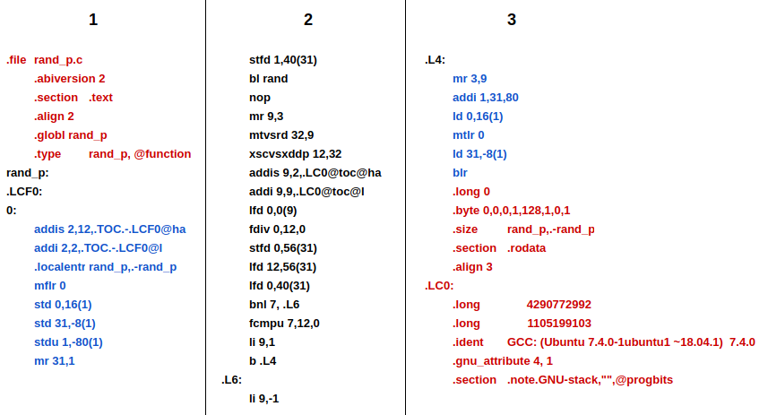

# Introducing Power Architecture's Assembly Language

As programmers, we’re fairly used to high level coding and optimization, but we rarely work on lower level languages such as assembly. Even so, understanding these languages is essential for several reasons: optimization, portability, etc. Also, the standard learning languages for assembly tend to be either for Intel’s x86 and/or ARMv7 architectures, leaving aside many others. 

In this post, we’ll be introducing the Power instruction set architecture (to be precise, the PowerPC 64-bit little-endian architecture) and walking through the initial steps for studying and analysing assembly code in Power. More specifically, the code which we’ll compile and analyse is a C program with a single function which returns one or minus one given a probability (which is passed as a function parameter) using C's standard random number generator.

## Compiling for Power Processors

*  **Using a Power Machine**

    The most simple and straightforward method for obtaining an assembler or binary code for Power architecture is using a Power machine. You can access the Minicloud website and request a free Power VM. Once you’ve setup the VM and installed GCC, all you have to do is compile it.

    * [Setting Up a Power VM at Minicloud](https://github.com/Unicamp-OpenPower/minicloud/wiki/Getting-Started-with-Minicloud)

*  **Using GCC Packages**
    
    To install a GCC version which can cross compile for power machines we can simply use `sudo apt install gcc-7-powerpc64le-linux-gnu`.
    The *powerpc64le-linux-gnu* suffix is what we call target Here we’re specifying that we want to install GCC v7 for powerpc66le architecture which  runs linux-gnu OS. Upon installing the cross compiler we can get the assembly code using `powerpc64le-linux-gnu-gcc program.c -S`.


## **Overview of the C code**

```C
#include <stdlib.h>
#include <time.h>

int rand_p(double p) {
    double r = (double)rand()/(double)RAND_MAX;

    if (r < p) return 1; //Returns with probability p
    else return -1;      //Returns with probability (1-p)
} 
```

Understanding the C code is quite trivial. We start with a variable ‘p’ passed as a parameter, and then we instantiate a variable ‘r’ with the casted result of the division of rand() by RAND_MAX. To wrap it up, we test if ‘r’ is smaller than ‘p’. If so, the return value is 1, and -1 otherwise. Should also be noted that the code only works because *rand()* returns a random value between [0,RAND_MAX] with uniform probability. Now let us see if we can establish a similar analysis but with the assembly code.

## Overview of the Assembly Code

Since we’re starting with the basics, we’ll be skipping some lines of code which aren't necessary for grasping the general idea of what’s happening within the program.
We can split the code into three main blocks: directives, function call handling and the program logic.



* The [directives](http://www.idc-online.com/technical_references/pdfs/electronic_engineering/Assembler_Directives.pdf) (Red) assist in guiding the assembly process as well as inserting data.
* Functions calls demands a series of conventions (Blue) to allow the proper integration of the code within multiple environments. These are defined by the Power’s [ABI](http://www.idc-online.com/technical_references/pdfs/electronic_engineering/Assembler_Directives.pdf) (Application's Binary Interface), which has a dedicated document for it’s description. 
* The program logic (Black) is where the code we’ve written is translated to the assembler code. This is the section which we’ll be analysing here.

## Preliminary Notes

Before we can dive in, there's a few concepts which must be known beforehand to fully understand the assembly code:

* **Register Types:** There are multiple register types within the Power architecture, the following initials will be used:
    * GX stands for General purpose register X.
    * FX stands for Floating point register X.
    * LR and CR refers to Linked Register and Condition Register respectively. These are considered Special Registers.

* **Special Registers:** Some registers have designated functions within  the architecture, such as:
    * **CR** which contains 8 adressable fields (with 4 bits each) for saving the result of comparison instructions.
    * **LR** keeps the return address of a function call when the instruction BL (Branch Linked) is used, and can be used to return to the calling point with the instruction BLR (Branch to Linked Register).

* **Parameters and Return Registers:** The Power ABI defines a set of registers (both GX and FX types) which ares used as variables when returning values or passing parameters to functions. The registers G[3,10] and F[1,13] are such registers. <br> *Example:* if we have `f(int w, int x, float y, double z)`, the registers G3, G4, F1 and F2 will contain w, x, y and z respectively when `f` is called.

* **Volatile and Nonvolatile Registers:** When a function is called, by the ABI's specifications, *nonvolatile* registers are presumed to remain intact, meaning that their values either won't change or will be restored by any called function. On the other hand, *volatile* registers must be saved by the caller if necessary, since these can be altered at will by any called function.

* **Table of Contents (TOC):** For now, all we need to know is that `RAND_MAX` is kept here, and to access it we'll need the address of the table plus an offset. The directives below `.LCO:` are responsible for defining the offset.

*Observation:* These informations can be found within the [Power ISA](https://openpowerfoundation.org/?resource_lib=power-isa-version-3-0) and [Power ABI](http://www.idc-online.com/technical_references/pdfs/electronic_engineering/Assembler_Directives.pdf) specifications.
   
```
[...]
 7  rand_p: 
 8  .LCF0:
 9  0:	
10      addis 2,12,.TOC.-.LCF0@ha
11   	addi 2,2,.TOC.-.LCF0@l
[...]
18      stfd 1,40(31)
19   	bl rand
20   	nop
21  	mr 9,3
22  	mtvsrd 32,9
23 	    xscvsxddp 12,32
24  	addis 9,2,.LC0@toc@ha
25  	addi 9,9,.LC0@toc@l
26  	lfd 0,0(9)
27   	fdiv 0,12,0
28  	stfd 0,56(31)
29  	lfd 12,56(31)
30  	lfd 0,40(31)
31  	fcmpu 7,12,0
32      bnl 7,.L6
33  	li 9,1
34  	b .L4
35  .L6:
36      li 9,-1
37  .L4:
38      mr 3,9
39	    addi 1,31,80
40	    ld 0,16(1)
41	    mtlr 0
42	    ld 31,-8(1)
43	    blr
[...]
```

## **Analysing the Assembly Code**

First, let’s locate where is the parameter ‘p’. Since ‘p’ is a Float and it’s also the single parameter passed, it’s located at FPR1 (as specified by the ABI).

The **lines 10 and 11** initialize the **TOC base pointer at G2** using the ADDIS and ADD instructions. We'll use this value later for obtaining `RAND_MAX` from memory. Let’s ignore the `.localentry` directive that follows. 

At line 19, the compiler calls the *rand()* function with the BL instruction, since ***rand()* returns an integer, it’s return value will be placed at G3 (as specified by the ABI) and will be converted to a double at lines 22 and 23** which involves more complicated instructions. Also, in these lines, the value in **G3 is transferred to F12**. Note that **FPR1 is saved at line 17**, since FPR1 is a volatile register and can be lost during *rand()*'s execution. The NOP instruction does literally nothing, but it does have a purpose  in the bigger picture.
 
At the next step, the compiler will load RAND_MAX. Lines 24 and 25 adds an offset to the TOC pointer (G2) and saves the result at G9. Now, G9 withholds the absolute address of RAND_MAX’s value. To load RAND_MAX’s value, we can use LFD (line 26) using G9 as the offset and **setting G0 as RAND_MAX**. Note that the LFD instruction interprets the value 0, not as the register G0, but as the number 0, as describes the ISA.

**We have *rand()*’s return value and RAND_MAX constant**, both at floating point registers, therefore, we can finally **divide these values** to initialize the variable ‘r’. This division is observed at line 27 by the FDIV instruction, where F12 is divided by F0 and the result saved in F0. In other words, **F0 now stores the variable ‘r’ of our C program**. In line 28 and 29, the value of **F0 is stored and then loaded in F12**, probably due to poor optimization.

Since F1 might have change during *rand()*’s execution, we must restore F1 with its saved value by loading it from the memory address we saved it in line 18. This can be observed at line 30, where **the saved value of our parameter ‘p’ is loaded into F0**. 

**We finally have `r` in F12 and `p` in F0**, meaning that these values can be compared.The instruction FCMPU at line 31 is responsible for **comparing F12 with F0 and storing their relation at CR's 7th field**. 

At line 32, the if-else structure is built. First, a **BNL instruction checks if F12 is NOT smaller than F0** (by checking CR's 7th field) and, if true, jumps to label .L6 loading -1 into G9, otherwise does not branch and loads 1 at G9. Note that the conditional here (‘r’ >=  ‘p’) is the negation of the one present in the C code.

**Finally, we have the function’s return value at G9**. To properly end the function call, there are few rules established by the ABI which should be followed, but we won't cover all of them here. For now, we’ll focus on two steps: **Moving result from G9 to G3 and loading the return address**. The first one is relevant because the caller function will consider that our function’s return value is at G3, therefore, G9 is moved to G3 at line 38 by the MR instruction. The second step ensures that we return to the point where our function was called. For this, we’ll restore the value of the LR register at line 40 using the MTLR instruction.

To end our function’s execution, BLR is invoked at line 43 and the function call ends.

## **Conclusion**
As short and simple a C program is, when analysed by it’s assembly code, can be quite complex. As seen here, what can be described in a paragraph at high level code, can turn to a long text at low level code (not to mention that we ignored a large portion of the code). The increased complexity is mostly due to the several elements which are omitted for the programmers sake when using high level languages, but this comes at a cost. These instructions can be combined in multiple ways, and the optimal way to do so depends on the program, it’s compilation and the host architecture, resulting in countless combinations which makes the automated optimization process extremely complicated. So overall, understanding such low level code and it’s host architecture is relevant for writing efficient programs.  
